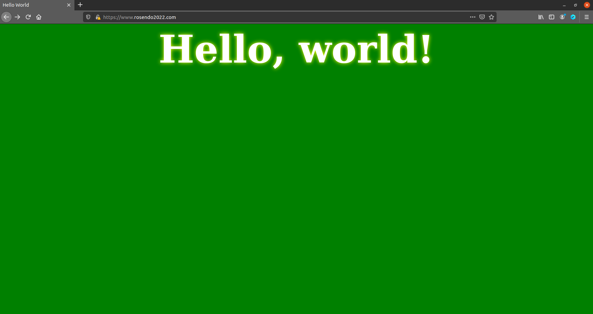

# Trabalho realizado na Semana #11

## Task 1: Becoming a Certificate Authority (CA)

### The Configuration File

In order to set up the Certificate Authority, we started by copying the configuration file
to our working directory, creating database index file and setting up current serial number.

We must change the default path of environment variable of OPENSSL_CONF in order to 
assign it to our new openssl.cnf file.

### Certificate Authority (CA)

We must generate a self-signed certificate for our CA and, in order to do that, we must create a 
private key and the public-key certificate.

Information obtained from ca.crt:
- There is a flag in the certificate, under Basic Constraints, in the section X509v3 extensions, which says if it is a CA certificate

- The issuer and subject are exactly the same so we know it is a self-signed certificate.

Information obtained from ca.key:
- Certificate keys values
    - Public Exponent: `65537`
    - Private Exponent: 
    `
    09:d7:a7:0e:50:8a:92:4e:12:91:cb:2b:b8:6e:7c:
    cd:2f:a0:c3:b8:1d:ca:bb:7d:06:36:7c:66:4e:31:
    55:a4:3f:e1:70:e1:69:1e:e4:e6:3c:e4:ad:fd:bf:
    5a:0b:55:a1:d5:bf:e3:1d:38:82:5d:0d:e7:02:0b:
    8f:37:de:e9:da:02:4f:bb:b7:31:ed:4a:f9:06:94:
    29:ed:22:25:cc:5e:6f:b8:cd:64:73:22:00:d6:f9:
    9e:49:47:ae:27:14:9d:c2:75:ff:0b:53:cc:f3:3b:
    5f:a6:e4:82:9e:6c:e5:99:e8:5a:8a:ef:cc:1c:de:
    20:93:5f:e5:fe:26:a0:50:cb:a3:2e:f5:a1:74:71:
    f5:ac:23:49:d3:8b:5b:33:ad:57:5f:7e:19:a9:70:
    3d:1d:9c:43:ab:99:ad:a1:ba:76:ba:e1:a9:df:9d:
    47:6c:57:df:1c:2f:f2:dd:09:3c:d4:34:77:6a:4f:
    e2:b5:7a:96:d9:08:dd:a0:2d:8d:ac:a8:cb:45:32:
    f0:66:d9:8d:fe:45:66:0e:6e:6b:32:5e:9a:01:a5:
    c6:ee:6a:00:44:04:25:ef:79:16:74:b1:7d:f6:c8:
    8e:a6:73:f0:7c:8c:4e:33:f8:e4:13:f8:f4:b6:e4:
    05:23:ad:15:46:97:87:69:7a:05:e1:1b:20:9b:50:
    17:1f:f8:d6:fa:d4:a6:a5:d0:81:e0:49:cb:aa:24:
    11:6b:91:98:89:4f:ff:1c:e7:b5:06:33:18:ec:c4:
    05:d1:63:0a:1d:9b:a3:46:d7:cd:0d:49:ea:47:90:
    a5:03:be:e7:97:b2:67:30:e2:07:61:46:d1:d1:63:
    74:3e:5d:00:58:e1:b5:7c:1d:78:6c:6d:6f:e7:cd:
    59:7a:ca:63:e1:24:25:d3:b5:c7:5b:27:81:d9:98:
    c9:a7:0c:be:63:a7:d5:41:55:cb:1c:6f:ca:96:38:
    ff:81:a4:9f:81:72:55:ac:48:e7:d5:c2:70:74:7f:
    6f:22:64:d6:23:19:a0:e2:86:06:f3:a4:f2:18:ce:
    e3:e6:35:b2:55:ef:01:f4:ae:c4:98:a2:4e:a1:aa:
    06:c2:12:89:24:52:69:08:76:f7:d5:7c:1a:05:9f:
    29:b0:00:f5:c7:39:68:d9:48:e3:39:7c:f6:cc:f7:
    c3:9f:0f:cf:4c:19:e5:56:99:5a:7b:bc:21:f3:4e:
    84:49:04:e0:9b:5f:33:91:86:ab:d2:4c:41:cd:c1:
    1c:a9:89:ef:e0:c5:58:14:75:cd:44:1b:b6:cf:37:
    87:2a:0a:82:dd:79:fd:9f:fe:76:9c:6a:5e:03:2d:
    8b:a2:54:36:88:05:2b:06:c0:a3:b7:cb:a1:42:ef:9d:f9
    `

    - Modulus: 
    `
    00:a2:9a:08:42:0e:20:10:0b:ac:19:68:b4:68:2b:
    2f:ed:2f:2b:84:69:ac:29:a4:38:1f:b7:e4:6e:63:
    7c:57:dd:c4:5a:22:e7:06:aa:9f:fb:fc:50:fb:0e:
    fe:5f:8d:5e:9d:8c:57:0b:9f:6f:6b:ad:28:56:36:
    3e:6b:79:64:d8:a1:57:6c:bd:23:ca:db:56:d1:0e:
    56:a2:93:86:9c:33:a4:1c:9a:6e:f2:8b:ef:7a:5a:
    1d:e5:36:66:0d:ba:de:f2:f8:2d:02:fd:47:95:96:
    93:30:de:42:90:de:fe:21:59:c2:fb:3e:4b:b3:1e:
    cc:25:02:6b:15:3b:fd:93:ef:7a:07:86:37:23:2c:
    cf:ee:53:0c:f7:fc:b8:7b:52:d4:82:26:af:79:3a:
    02:19:cd:9f:ed:ec:14:fc:ed:be:55:ea:36:a4:a3:
    db:8a:a7:de:26:56:06:85:63:31:5b:cb:2a:c2:ae:
    10:32:f0:88:0e:2c:40:30:14:56:d9:e0:05:ac:9f:
    aa:a9:93:d7:45:1a:5a:c0:f0:dd:94:8a:37:22:8a:
    78:f8:97:52:f7:ce:35:2b:ec:0f:9c:bc:2c:4f:c7:
    a1:e0:0e:9f:53:99:d4:f0:da:51:b3:85:32:71:b2:
    38:a9:50:3a:66:11:bb:da:a2:d7:e2:42:46:73:69:
    8e:33:07:a9:21:57:b1:47:d6:f2:84:06:ce:94:fd:
    8e:4d:93:43:a4:a1:a2:8e:d7:6f:dc:76:47:82:18:
    4c:c5:32:64:9c:1f:e7:c6:2c:51:8b:d6:f7:f9:c3:
    45:e1:17:4f:81:89:cc:3b:a0:d9:5a:03:66:12:21:
    c8:6e:36:b7:68:a4:e2:b9:32:2f:7c:4f:7b:d6:c0:
    03:08:b2:0f:a5:47:2e:31:55:a2:ec:1e:89:40:b2:
    fc:6b:be:07:24:49:49:86:f3:70:b7:23:d7:d0:b7:
    74:c7:2e:b5:cf:2e:68:ce:77:14:9d:df:f2:5a:f1:
    98:9e:c2:0b:72:57:cc:e1:21:6a:9c:32:9f:72:0d:
    b9:a8:46:e1:a8:6b:3e:54:04:57:db:3a:07:01:aa:
    9c:ed:a5:b3:fb:5b:34:68:05:90:0c:ce:04:f1:df:
    bc:9d:4a:b8:85:98:e9:52:ad:cd:d2:82:0b:b1:95:
    86:3a:2f:03:1a:78:89:1c:3a:10:aa:17:5b:ff:db:
    b7:a9:73:f8:bb:29:72:57:b7:d1:12:cb:f7:c0:96:
    4b:84:5c:33:d3:51:7f:b3:ad:12:0c:61:c9:cf:f7:
    aa:61:ad:ac:52:03:2f:df:48:e3:0a:02:66:c4:2c:
    8e:51:89:59:e9:f4:e9:43:c6:d1:16:1d:09:ec:0e:45:78:27
    `

    - Secret Prime Number p: 
    `
    00:ce:cc:f6:0f:cd:6d:49:02:0a:f4:e3:c8:85:04:
    5e:fb:5c:41:f7:0b:fc:2d:f1:f6:f3:e8:f5:25:f8:
    e1:8f:c4:6a:68:03:90:17:95:c5:26:5b:a8:14:fd:
    48:5e:6b:bd:86:b8:f2:77:76:77:d3:de:fb:3e:db:
    03:1f:fb:dd:b3:02:04:22:28:fa:32:44:7f:a4:86:
    48:1e:7e:d2:85:a4:20:29:54:39:26:86:18:67:9f:
    28:a7:ae:0b:aa:4e:d6:9a:36:62:8d:53:bd:37:56:
    c3:8b:09:17:2f:fb:7a:c5:42:ec:7f:5f:3c:f8:b2:
    da:1b:9a:89:16:ea:08:88:01:97:6c:4c:b2:0d:d1:
    9e:26:4a:fa:9f:4c:f4:a5:4a:3c:eb:3f:8d:0b:0b:
    21:53:7c:d9:90:33:4d:87:8f:50:e7:32:90:47:74:
    7a:10:99:56:3a:d0:f1:9d:05:b6:bd:9c:30:5e:6d:
    a5:e3:7c:c8:7a:13:88:f3:c1:1e:9e:7f:1a:88:37:
    be:a7:b6:95:b8:67:07:0d:0b:e9:ae:8f:0f:24:ba:
    9c:1e:9d:5d:c8:a9:5e:3e:76:8b:d4:b5:f9:a8:c8:
    42:a4:fa:f8:d5:64:6b:7a:98:7f:9e:6b:9a:b7:a3:
    20:0c:56:c0:ff:65:f7:99:34:ac:b8:86:60:e3:64:e3:f5
    ` 

    - Secret Prime Number q:
    `
    00:c9:49:2a:d9:b1:4b:43:33:69:b9:76:e6:cd:de:
    2c:d3:77:59:b3:c8:2b:bd:40:14:3c:9a:1b:1e:cb:
    3c:88:d2:6e:b9:64:40:3e:ff:48:a6:ff:56:f1:03:
    d5:08:ea:42:f9:12:b6:54:fe:f8:6d:fb:6f:69:54:
    b1:a2:6d:ed:d0:e5:e9:26:ce:e9:3e:54:8d:4c:94:
    7b:63:7f:5b:35:2d:fb:3d:c1:b1:09:82:6a:3d:62:
    58:12:20:bb:26:ff:ca:ec:cf:6f:9c:b7:a2:d3:74:
    91:d3:ce:b7:bb:31:d2:02:51:75:93:cb:b2:b9:36:
    11:f8:97:b9:b2:7a:6f:03:b3:64:d1:f2:18:e0:6a:
    59:6e:60:4e:b3:23:e8:96:4f:8d:70:57:9a:91:f9:
    ab:04:1c:b9:74:0b:25:cb:1e:76:d2:a0:98:13:fa:
    7c:34:da:57:d1:45:ff:b4:b6:01:ac:07:b7:d0:63:
    76:9f:10:fa:2b:d0:26:81:71:39:b4:31:63:96:74:
    43:5d:c4:b8:2c:12:49:d8:1e:f7:9e:db:1a:3e:55:
    30:16:71:42:f5:c0:eb:28:eb:8a:3c:9b:5c:48:26:
    6f:ba:2d:83:c5:64:00:19:a8:c8:8b:06:4c:65:e9:
    44:fc:37:2e:9f:72:31:88:0a:dc:5c:7d:47:c2:57:b6:2b
    `

## Task 2: Generating a Certificate Request for Your Web Server

In order to send the public-key certificate from our CA to our own server we must create a Certificate Signing Request which includes the company's public key and identity information which will then be verified by the CA and in order to generate a certificate.

Additionally, in order for ourwebsite's certificate to have multiple hostnames, we must specify them in the in the
certificate, using the *Subject Alternative Name* extension. In our case, we used the following alternative hostnames:
```
X509v3 Subject Alternative Name: 
    DNS:www.rosendo2022.com, DNS:www.rosendo2021.com, DNS:www.rosendo2023.com
```

## Task 3: Generating a Certificate for your server

By running the command presented in the lab's pdf, we use our own Certificate Authority (ca.crt and ca.key) to sign
the certificate request made by our web server and finally generate our certificate for it. It will be stored
in server.crt and the key at servey.key. In our case, this is our server's certificate:

```
Certificate:
    Data:
        Version: 3 (0x2)
        Serial Number: 4096 (0x1000)
        Signature Algorithm: sha256WithRSAEncryption
        Issuer: C=PT, ST=Porto, L=Porto, O=FEUP, OU=DEI, CN=Bruno Rosendo/emailAddress=brunomrosendo@hotmail.com
        Validity
            Not Before: Jan 19 08:52:53 2022 GMT
            Not After : Jan 17 08:52:53 2032 GMT
        Subject: C=PT, O=rosendo2022 Inc., CN=www.rosendo2022.com
        Subject Public Key Info:
            Public Key Algorithm: rsaEncryption
                RSA Public-Key: (2048 bit)
                Modulus:
                    00:d0:c1:1e:70:9b:4a:d1:ac:94:b3:d2:a0:c9:f0:
                    77:4b:41:46:03:0f:60:70:7c:8e:5e:5f:e1:5d:fe:
                    da:16:91:e6:83:f0:7f:0a:8f:e0:6d:4c:5f:db:25:
                    ee:29:ef:f1:da:44:85:c8:eb:3e:96:12:c4:6e:b0:
                    25:84:24:41:58:95:64:a6:d8:83:79:4f:92:42:da:
                    ba:d1:db:0f:cd:1c:d5:a6:26:12:59:67:d1:1a:c0:
                    c0:e0:19:27:18:82:77:d7:2c:46:8f:ee:9c:36:ae:
                    ef:df:fa:38:28:f2:ac:ba:4e:7f:c6:03:90:54:4b:
                    5a:f6:5e:61:21:9d:02:83:aa:40:ac:a0:dd:44:ab:
                    87:a7:28:14:90:17:60:2a:38:d4:88:d2:da:03:c2:
                    a4:6d:e3:db:66:ef:44:95:b2:4f:e4:c6:92:df:7d:
                    fa:82:d4:7b:f3:87:9f:e9:7f:ce:a0:dd:86:00:a7:
                    6a:f3:f1:bc:ad:7e:af:08:26:51:86:e3:ba:59:2b:
                    17:5e:18:95:08:13:3a:e8:29:b8:7c:f0:19:72:56:
                    ed:94:63:a2:89:c1:43:04:73:fd:0b:5c:e2:33:50:
                    84:00:6e:8c:76:9d:65:b6:07:f8:c0:27:15:28:61:
                    66:3e:32:cd:0c:ab:12:0a:c2:6e:a7:61:fd:a5:0a:
                    8b:a5
                Exponent: 65537 (0x10001)
        X509v3 extensions:
            X509v3 Basic Constraints: 
                CA:FALSE
            Netscape Comment: 
                OpenSSL Generated Certificate
            X509v3 Subject Key Identifier: 
                6D:EF:3B:3A:88:F7:24:8E:B6:5C:6F:B4:DE:69:5A:0F:36:B5:1E:5A
            X509v3 Authority Key Identifier: 
                keyid:77:BA:D7:2F:D6:DA:E2:28:B2:76:22:C8:6F:3D:55:D9:76:FE:2B:64

    Signature Algorithm: sha256WithRSAEncryption
         6c:0c:a1:75:eb:ab:1d:73:30:d6:46:14:58:fc:a8:41:7b:50:
         8a:ab:46:57:52:17:7e:6a:aa:7e:a6:b7:bf:e5:17:5b:aa:54:
         38:db:e0:4c:c1:1a:19:f5:db:92:b5:c9:d3:1f:04:5e:4d:0d:
         5a:23:77:5c:9f:34:93:db:ea:64:ab:92:d0:33:42:a4:54:ac:
         a2:80:af:bb:b6:92:35:5c:b1:64:ef:1b:33:9b:1d:a2:89:26:
         d5:27:64:1c:d4:0d:03:eb:4d:12:49:2f:e7:87:43:39:f5:90:
         fa:d9:18:a8:de:79:b3:10:3c:a0:da:28:a6:0f:1c:cc:00:0f:
         4d:b4:d3:df:d8:df:6f:61:38:3d:7f:86:05:fd:45:48:64:25:
         92:83:0f:25:e7:a4:f1:2c:0b:fa:ec:a7:05:6a:01:10:bb:4e:
         0c:e1:8f:7f:75:c1:5a:62:09:c1:8b:22:b7:0b:4f:04:81:45:
         5e:6f:66:e0:d8:e2:1c:b2:4c:eb:ce:ec:6e:d3:cd:2e:b2:59:
         66:70:65:a5:e9:9e:17:e2:cf:86:27:83:7f:94:c2:3d:0b:93:
         dc:7c:cd:da:e0:39:04:ed:93:1b:a0:cf:54:d7:82:61:36:4a:
         db:b3:83:df:f1:be:5b:ff:f0:54:a7:92:a1:f7:ee:d7:1e:c1:
         43:66:87:0d:a9:56:95:64:56:85:28:eb:89:75:5d:89:bd:eb:
         0a:7a:88:6f:be:de:4f:74:c9:0a:e7:74:8b:d4:29:82:d2:24:
         b3:5b:00:25:0e:33:b0:3c:12:3b:ec:24:d7:c0:45:18:08:4d:
         ff:06:6f:cb:67:e1:33:37:38:27:a8:23:bf:41:19:fb:90:88:
         b8:57:ec:5c:04:b3:7a:21:92:ca:bf:6d:1f:f3:d6:a3:90:33:
         33:2f:b0:79:d0:82:f2:c5:88:ee:2d:05:b0:78:f3:30:07:5f:
         39:5e:e7:73:90:ab:13:88:4d:6d:6c:98:9a:5b:ba:f0:d9:c4:
         5d:9a:38:5d:ff:b1:5d:0f:66:09:7c:38:fe:9d:27:67:0e:fe:
         d5:e6:a9:3f:f1:bf:ec:83:64:da:bf:ce:2d:34:9a:d7:fb:4c:
         25:6f:48:f3:87:7c:b3:8d:40:c3:ab:20:50:f0:8a:11:45:19:
         0d:bd:46:05:a7:b3:bd:93:15:9c:a9:97:7f:d2:29:9e:62:a2:
         13:53:b0:2f:0a:10:47:a2:5f:f9:be:10:92:b9:2e:fe:cb:ad:
         ef:2e:68:8c:3b:23:d4:69:c8:e7:d3:74:62:42:c3:76:3b:84:
         88:56:b9:29:8a:1f:d4:ef:a4:25:c8:eb:d7:a3:6e:33:75:04:
         21:a4:1d:bb:8e:ca:8e:84
-----BEGIN CERTIFICATE-----
MIIEyjCCArKgAwIBAgICEAAwDQYJKoZIhvcNAQELBQAwgYwxCzAJBgNVBAYTAlBU
MQ4wDAYDVQQIDAVQb3J0bzEOMAwGA1UEBwwFUG9ydG8xDTALBgNVBAoMBEZFVVAx
DDAKBgNVBAsMA0RFSTEWMBQGA1UEAwwNQnJ1bm8gUm9zZW5kbzEoMCYGCSqGSIb3
DQEJARYZYnJ1bm9tcm9zZW5kb0Bob3RtYWlsLmNvbTAeFw0yMjAxMTkwODUyNTNa
Fw0zMjAxMTcwODUyNTNaMEYxCzAJBgNVBAYTAlBUMRkwFwYDVQQKDBByb3NlbmRv
MjAyMiBJbmMuMRwwGgYDVQQDDBN3d3cucm9zZW5kbzIwMjIuY29tMIIBIjANBgkq
hkiG9w0BAQEFAAOCAQ8AMIIBCgKCAQEA0MEecJtK0ayUs9KgyfB3S0FGAw9gcHyO
Xl/hXf7aFpHmg/B/Co/gbUxf2yXuKe/x2kSFyOs+lhLEbrAlhCRBWJVkptiDeU+S
Qtq60dsPzRzVpiYSWWfRGsDA4BknGIJ31yxGj+6cNq7v3/o4KPKsuk5/xgOQVEta
9l5hIZ0Cg6pArKDdRKuHpygUkBdgKjjUiNLaA8KkbePbZu9ElbJP5MaS3336gtR7
84ef6X/OoN2GAKdq8/G8rX6vCCZRhuO6WSsXXhiVCBM66Cm4fPAZclbtlGOiicFD
BHP9C1ziM1CEAG6Mdp1ltgf4wCcVKGFmPjLNDKsSCsJup2H9pQqLpQIDAQABo3sw
eTAJBgNVHRMEAjAAMCwGCWCGSAGG+EIBDQQfFh1PcGVuU1NMIEdlbmVyYXRlZCBD
ZXJ0aWZpY2F0ZTAdBgNVHQ4EFgQUbe87Ooj3JI62XG+03mlaDza1HlowHwYDVR0j
BBgwFoAUd7rXL9ba4iiydiLIbz1V2Xb+K2QwDQYJKoZIhvcNAQELBQADggIBAGwM
oXXrqx1zMNZGFFj8qEF7UIqrRldSF35qqn6mt7/lF1uqVDjb4EzBGhn125K1ydMf
BF5NDVojd1yfNJPb6mSrktAzQqRUrKKAr7u2kjVcsWTvGzObHaKJJtUnZBzUDQPr
TRJJL+eHQzn1kPrZGKjeebMQPKDaKKYPHMwAD02009/Y329hOD1/hgX9RUhkJZKD
DyXnpPEsC/rspwVqARC7Tgzhj391wVpiCcGLIrcLTwSBRV5vZuDY4hyyTOvO7G7T
zS6yWWZwZaXpnhfiz4Yng3+Uwj0Lk9x8zdrgOQTtkxugz1TXgmE2Stuzg9/xvlv/
8FSnkqH37tcewUNmhw2pVpVkVoUo64l1XYm96wp6iG++3k90yQrndIvUKYLSJLNb
ACUOM7A8EjvsJNfARRgITf8Gb8tn4TM3OCeoI79BGfuQiLhX7FwEs3ohksq/bR/z
1qOQMzMvsHnQgvLFiO4tBbB48zAHXzle53OQqxOITW1smJpbuvDZxF2aOF3/sV0P
Zgl8OP6dJ2cO/tXmqT/xv+yDZNq/zi00mtf7TCVvSPOHfLONQMOrIFDwihFFGQ29
RgWns72TFZypl3/SKZ5iohNTsC8KEEeiX/m+EJK5Lv7Lre8uaIw7I9RpyOfTdGJC
w3Y7hIhWuSmKH9TvpCXI69ejbjN1BCGkHbuOyo6E
-----END CERTIFICATE-----
```

This way, however, the alternative hostnames are not present. For this, we must enable the `copy_extensions = copy`
field in *openssl.cnf*, which is disabled by default. After this is done, we can sign the certificate again and
check with `openssl x509 -in server.crt -text -noout` that the certificate now has the following lines:
```
X509v3 extensions:
            X509v3 Basic Constraints: 
                CA:FALSE
            Netscape Comment: 
                OpenSSL Generated Certificate
            X509v3 Subject Key Identifier: 
                6D:EF:3B:3A:88:F7:24:8E:B6:5C:6F:B4:DE:69:5A:0F:36:B5:1E:5A
            X509v3 Authority Key Identifier: 
                keyid:77:BA:D7:2F:D6:DA:E2:28:B2:76:22:C8:6F:3D:55:D9:76:FE:2B:64

            X509v3 Subject Alternative Name: 
                DNS:www.rosendo2022.com, DNS:www.rosendo2021.com, DNS:www.rosendo2023.com
```

## Task 4: Deploying Certificate in an Apache-Based HTTPS Website

In order to setup our HTTPS site, we needed to include the server's certificate and key inside the docker container,
under /certs/, besides the already included `bank32.crt` and `bank32.key`. After that, we also needed
to change the virtualhost configuration in `/etc/apache2/sites-available/bank32_apache_ssl.conf`. This is our configuration:

```
<VirtualHost *:443> 
    DocumentRoot /var/www/bank32
    ServerName www.rosendo2022.com
    ServerAlias www.rosendo2021.com
    ServerAlias www.rosendo2023.com
    DirectoryIndex index.html
    SSLEngine On 
    SSLCertificateFile /certs/server.crt
    SSLCertificateKeyFile /certs/server.key
</VirtualHost>
```

The 443 is used since it's the default port for an HTTPS site.
After accepting the security warning, we can successfully browse the website:



However, the connection is still not secure:


To solve this issue, we need to tell the browser to trust our Certificate Authority, by going into
`about:preferences#privacy`, and loading the `ca.crt` like so:


Now, we can successfully browse the website without any warnings:


## Task 5: Launching a Man-In-The-Middle Attack

In order to launch a Man-In-The-Middle attack, we changed the victim's `/etc/hosts` file to translate the address
`www.facebook.com` to our IP address, where our site is located, like so:

`10.9.0.80 www.facebook.com`

With this line, the browser will connect to our site instead of Facebook's one. However, the browser would
still launch a security exception and not let us in:


This happens because the certificate we have generated is not valid for the Facebook's hostname. The browser
is capable of detecting this and stops us from accessing the flawed website.

## Task 6: Launching a Man-In-The-Middle Attack with a Compromised CA

This time, we will launch the MITM attack after compromising the Certificate Authority. To simulate this,
we generated a certificate for the `www.facebook.com` hostname, following the same steps as in the tasks 2 and 3.
Then, we restart the apache server with the new certificate configurations, like we did in in task 4.

This is the configuration we used:
```
<VirtualHost *:443>
    DocumentRoot /var/www/bank32
    ServerName www.facebook.com
    DirectoryIndex index.html
    SSLEngine On
    SSLCertificateFile /certs/facebook.crt
    SSLCertificateKeyFile /certs/facebook.key
</VirtualHost>
```

After doing this, we can now successfully access to `www.facebook.com` and be directed to our site:


However, we can still see a warning by clicking the locket besides the address. This happens because our CA is not
in the browser's list of recognized and trusting authorities.


