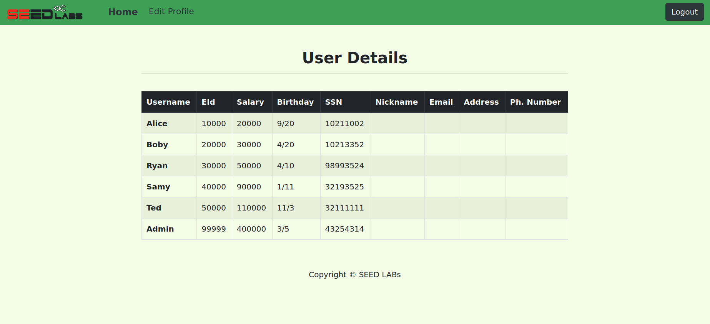
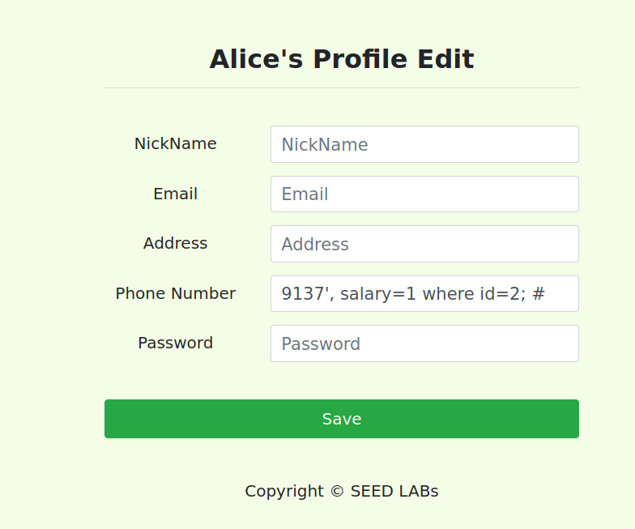

# Trabalho realizado na Semana #8 e 9

## Task 1: Get Familiar with SQL Statements

A informação da Alice pode ser obtida com o seguinte comando:

```sql
select * from credential where Name="Alice";
```


## Task 2.1: SQL Injection Attack from webpage

Esta tarefa é uma aplicação típica de SQL injection. Para nos autenticarmos como administrador, usamos o username `admin'; #`. Assim sendo, fechamos a string do nome e a instrução SQL, e de seguida comentamos a restante query, pelo que já não há verificação da password.



## Task 2.2: SQL Injection Attack from command line

Para executar a SQL injection a partir da command line, utilizamos o seguinte comando:

```sh
curl 'www.seed-server.com/unsafe_home.php?username=admin%27%3B%23&Password=123'
```

Com o resultado obtido, podemos ver a seguinte página:


## Task 2.3: Append a new SQL statement

Os *Multiple SQL statements* estão desativados por razões de segurança, tal como pode ser visto na seguinte documentação do MySQL:

https://github.com/mysqljs/mysql#multiple-statement-queries

Para ativar esta proteção, basta passar uma *flag* quando se abrea a conexão:

```js
var connection = mysql.createConnection({multipleStatements: true});
```

## Task 3.1: Modify your own salary

Para mudar o salário da Alice, precisamos primeiro de fazer o login na conta dela, tal como demonstrado na tarefa 2.1. Depois, podemos usar um dos campos do formulário para editar o salário:


Voltando ao perfil, podemos ver que o salário foi corretamente alterado:


## Task 3.2: Modify other people's salary

Da mesma forma que mudamos o salário da Alice, podemos alterar o do Boby mudando o id que está a ser selecionado na *query*:



Tambem podia ter sido usado *name=Boby* em vez de *id=2*


## CTF - Desafio 1

O primeiro desafio do CTF desta semana pode ser resolvido usando sql injection. Analisando o código podemos observar que o servidor está a validar as credenciais introduzidas a partir de uma query à base de dados. Uma vez que isto é feito de forma insegura, podemos modificar esta query, ignorando a password obtida na mesma. Para isso, introduzimos `admin';"` no utilizador, o que vai fazer com que a query termine sem validar a password introduzida. Desta forma, obtemos acesso ao sistema.

## CTF - Desafio 2

Neste desafio, o objetivo é encontrarmos o ficheiro flag.txt. Uma vez que temos um sistema de pings no servidor, observamos que este apenas concatena instruções aos comandos de ping. Utilizando `-V && cat /flag.txt`, conseguimos obter a flag do ficheiro flag.txt, que se encontra no root do sistema. A utilização do `-V` é necessária para terminar a instrução do ping, de forma a não termos erro dessa mesma instrução.